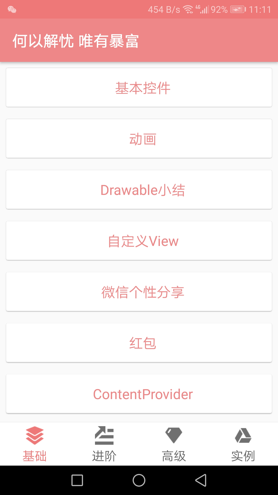
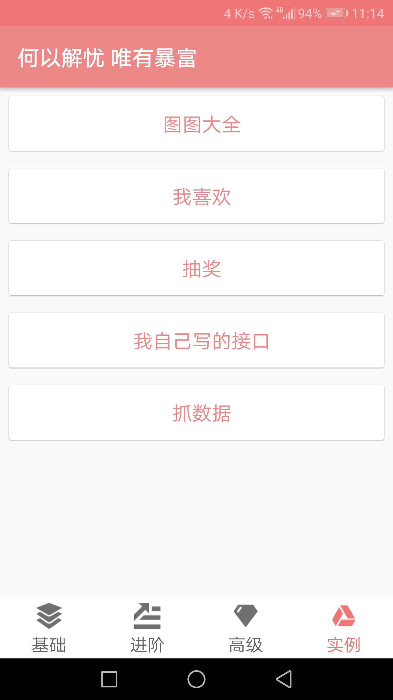

# APP简介
#### 集合了多种效果，和基础知识的一个应用

* java_lib 中主要集合了javaSE的一些基础知识，以及一些常用的设计模式demo
* app的module中是一些安卓的基础知识，特效的demo。包括四大组件的一些总结，一些动画效果的实现，一些框架的使用实例。
* library_swipe是一个滑动刷新的库
* base-adapter-library是鸿洋的封装的adapter一个库，挺好用的，有listView的adapter，RecycleView的adapter。

#### 下面是一些界面的截图和说明总结：
### 首页

**首页分为4个部分，基础知识，进阶特效、高级、实例**

#### 基础部分
1. 基本控件:recyclerView的使用、adapter局部更新、PopupWindow使用、Spinner使用等等
2. 动画：使用属性动画实现位移、旋转、透明等效果，以及一些组合效果。还有插值器的使用。
3. Drawable：使用drawable、TransitionDrawable实现图片不断循环播放的效果，关键代码如下：

	
#### 实例

实例目前只做了几个关于图片的东西。

1. 图图大全是用的百度api上的接口一个图片的查看器。

    其中用到[SmartTabLayout](https://github.com/ogaclejapan/SmartTabLayout)、[SwipeToLoadLayout](https://github.com/Aspsine/SwipeToLoadLayout)、[RecyclerViewPager](https://github.com/lsjwzh/RecyclerViewPager)、[PhotoView](https://github.com/chrisbanes/PhotoView)、[ThumbUpView](https://github.com/ldoublem/ThumbUp)等开源控件。
    
    网络请求框架用的是Retrofit，Retrofit的client是Okhttp，再结合Rxjava2

	其中图片预览最开始使用的是ViewPager，但是发现手感不好，有时候不能有效的滑动过去。于是找到了RecyclerViewPager这个框架。

2. 我喜欢 其实就是把图图大全里的图片把图片地址存在sqlite里面，然后可以浏览存在本地的地址的图片。
3. 使用[LuckyMonkeyPanelView](./app/src/main/java/allenhu/app/widget/LuckyMonkeyPanelView.java)做的一个抽奖界面
4. 暂时还未实现，
5. 仿照[welfare](https://github.com/boildcoffee/welfare)项目写的，抓取妹子图的照片，利用Jsoup解析。

截图

